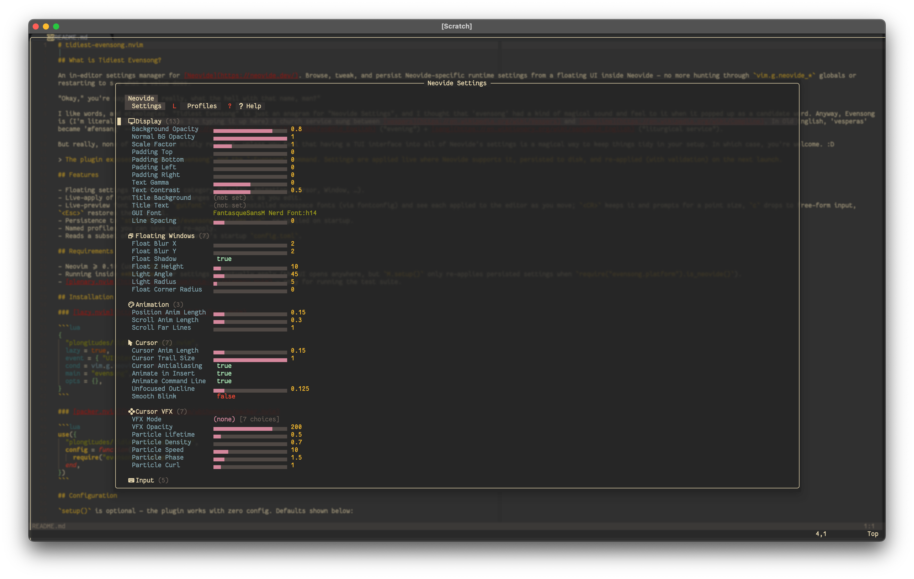
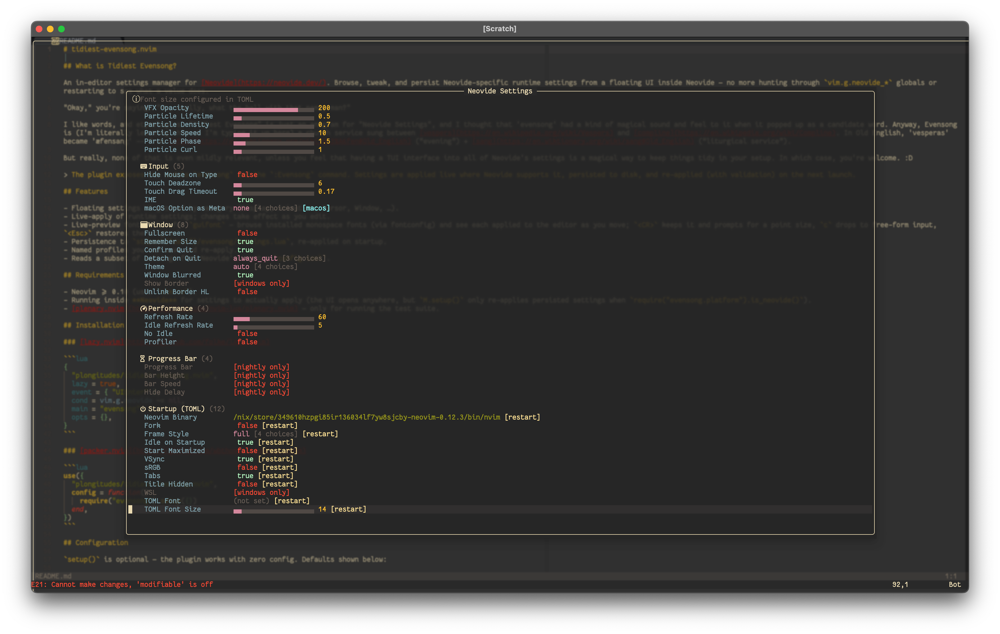

# tidiest-evensong.nvim




## What is Tidiest Evensong?

An in-editor settings manager for [Neovide](https://neovide.dev/). Browse, tweak, and persist Neovide-specific runtime settings from a floating UI inside Neovide — no more hunting through `vim.g.neovide_*` globals or restarting to see what a value does.

"Okay," you're saying. "No, really, what the hell with that name, man?"

I like words, and etymologies. "Tidiest Evensong" is just an anagram for "Neovide Settings", and I thought that 'evensong' had a kind of magical sound and feel to it when it popped up as a candidate word. Anyway, Evensong is (I'm literally learning this as I'm typing it up here) a church service sung between [vespers](https://en.wikipedia.org/wiki/Vespers) and [compline](https://en.wikipedia.org/wiki/Compline). In Old English, 'vesperas' became 'æfensang' -- from [ǣfen](https://en.wiktionary.org/wiki/%C3%A6fen#Old_English) (“evening”) + [sang](https://en.wiktionary.org/wiki/sang#Old_English) (“liturgical service”).

But really, none of that is even mildly relevant, unless you feel that having a TUI interface into all of Neovide's settings is a magical way to keep things tidy in your setup. In which case, you're welcome. :D

> The plugin exposes the module `evensong` and the `:Evensong` command. Settings are applied live where Neovide supports it, persisted to disk, and re-applied (with validation) on the next launch.

## Features

- Floating settings UI grouped by category (Display, Animation, Cursor, Window, …).
- Live-apply of runtime settings; changes take effect as you edit.
- Live-preview font picker for `guifont` — browse installed monospace fonts (via fontconfig) and see each applied to the editor as you move; `<CR>` keeps it and prompts for a point size, `c` drops to free-form input, `<Esc>` restores the original.
- Persistence to `stdpath("data")/evensong/settings.lua`, re-applied on startup.
- Named profiles you can save and re-apply.
- Reads a subset of settings from Neovide's startup `config.toml`.
- Version-drift banner in the header: the settings list is hand-maintained and pinned to a Neovide release (Neovide exposes no way to discover its settings at runtime), so the UI shows green when your Neovide matches that version (or is older) and a yellow caution when your Neovide is newer and may have settings not listed yet.

## Requirements

- Neovim >= 0.10 (uses `vim.uv`).
- Running inside **Neovide** — Evensong is Neovide-only. In plain Neovim it loads as a no-op: the `:Evensong` command isn't created and nothing is applied.
- [plenary.nvim](https://github.com/nvim-lua/plenary.nvim) — only for running the test suite.

## Compatibility

Neovide exposes no way to discover its settings at runtime, so Evensong's settings list is hand-maintained and pinned to a Neovide release.

| Evensong | Reconciled against Neovide |
|----------|----------------------------|
| 0.1.0    | 0.16.0                     |

A newer Neovide still works — the UI header shows a drift banner noting it may expose settings this version doesn't list yet.

## Installation

### [lazy.nvim](https://github.com/folke/lazy.nvim)

```lua
{
  "plongitudes/tidiest-evensong.nvim",
  main = "evensong",
  lazy = false,
  opts = {},
}
```

`lazy = false` keeps saved settings re-applying at startup, and is **required** if your
lazy.nvim setup uses `defaults = { lazy = true }` — without a load trigger the plugin
never loads, so `:Evensong` is never registered. (If you only want the command and don't
need startup re-apply, `cmd = "Evensong"` works too.) Loading Evensong outside Neovide is
a no-op, so there's nothing to defer.

### [packer.nvim](https://github.com/wbthomason/packer.nvim)

```lua
use({
  "plongitudes/tidiest-evensong.nvim",
  config = function()
    require("evensong").setup({})
  end,
})
```

## Configuration

`setup()` is optional — the plugin works with zero config. Defaults shown below:

```lua
require("evensong").setup({
  size = { width = 0.8, height = 0.8 }, -- floating UI size, as a fraction of the editor
  border = "rounded",                   -- any nvim_open_win border style
  backdrop = 60,                        -- dim the backdrop behind the UI (0-100)
  auto_apply = true,                    -- apply changes live as you edit
  data_path = nil,                      -- where settings.lua lives; defaults to
                                        --   stdpath("data") .. "/evensong"
  settings = {},                        -- your own default overrides, keyed by setting key,
                                        --   e.g. { theme = "dark", opacity = 0.95 }
  -- keys = { ... },                    -- override individual keymaps (see below)
  -- icons = { ... },                   -- override UI glyphs (see below)
})
```

Values in `settings` act as *your* defaults: they are applied on startup and are the baseline the persistence layer compares against when deciding what to write to disk.

The UI glyphs come from the `icons` table. Top-level keys are `bool_true`, `bool_false`, `collapsed`, `expanded`, `modified`, `restart`, `settings`, `profiles`, and `help`; `icons.category` maps each category name (e.g. `Display`, `Cursor`, `"Startup (TOML)"`) to its header glyph. Override any subset — unset keys keep the Nerd Font defaults, so if you don't use a patched font you can swap in plain text (e.g. `icons = { modified = "*" }`).

## Usage

```vim
:Evensong            " open the settings UI
:Evensong profiles   " open the profiles view
:Evensong help       " open the help view
:Evensong Window     " open focused on a category (matched by name)
```

Or from Lua: `require("evensong").open()`, `.close()`, `.toggle()`.

### Default keymaps (inside the UI)

| Key            | Action                          |
| -------------- | ------------------------------- |
| `<CR>`         | Activate — fold section · toggle bool · cycle enum · edit value |
| `j` / `k`      | Next / previous setting         |
| `l` / `h`      | Expand / collapse section; on a setting, increment / decrement value |
| `}` / `{`      | Next / previous section (also `]]` / `[[`) |
| `gg` / `G`     | Jump to top / bottom            |
| `r` / `R`      | Reset to your / factory default |
| `a`            | Apply — save changes to disk    |
| `S`            | Save current values as a profile|
| `L` / `?`      | Profiles view / help            |
| `q` / `<Esc>`  | Close & discard unsaved changes |

Most keys are configurable via the `keys` table in `setup()`; the built-in motions `j`/`k`, `gg`/`G`, and `]]`/`[[` are fixed. `<CR>` is the single "activate this row" key: it folds a section, toggles a boolean, cycles an enum, or edits any other value type. The description of the focused setting is shown in the window's top bar as you move.

Changes **preview live** as you edit, but are only **persisted when you Apply** (`a`). Closing with `q`/`<Esc>` reverts every change you haven't applied — back to how things were when you opened the menu (or your last Apply) — so you never have to hunt for each setting's original value.

## Development

```sh
make test   # run the plenary/busted suite headlessly
stylua .    # format (config in stylua.toml)
```

Tests live in `tests/` and cover the settings registry, value validation, and the persistence round-trip. CI runs `stylua --check` and the test suite on every push and PR.

## License

[MIT](./LICENSE)
